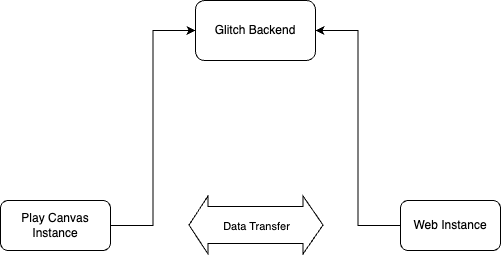

# interactive-storytelling
DT2140 - Final Project Repository

This repository contains code for the final project for Course DT2140 - Multimodal Interaction and Interfaces.

# Idea
This app is served as an interactive storytelling app (game) that uses a web-based remote (on phone) to control and progress through the story that plays out on a computer. The story revolves around a young adventurer named Max who is on the hunt for long last treasure. Through his adventure he faces three puzzles he must solve in order to reach the end. These puzzles are carefully crafted and rendered on the web-based game engine, PlayCanvas. The game instance runs on the web for maximal compatibility and is controlled with a phone. The solutions to the puzzles use a multitude of sensors on the phone: from ambient light sensors to gyro sensors. Watch the video demo further down in this README for further clarity.

# Service Interaction Design:

# Video Demo
[Jungle Mysteries: Interactive Storytelling Game](https://vimeo.com/902270834?share=copy)

# Access:

- Open on a computer: https://playcanv.as/p/epPFSECD/
- Open on a mobile phone (Android): https://junglemysteries.glitch.me/

**Disclaimer:** Since the app uses the Sensors API for its puzzles, make sure you have enabled sensor data access on your browser. This is usually behind a permissions flag. A simple Google search will show you how to do that. We need access to the Ambient Light Sensor, Accelerometer, and the Mic.

# How to Play:

- On the page open on your computer, progress through the story by pressing *Space*
- When you come across puzzles, turn to your phone and use the hints there to find the *secret code* that moves you to the next stage.

# Acknowledgement
This project was completed as part of the course DT2140 - Multimodal Interaction and Interfaces at KTH Royal Institute of Technology. We would like to thank our teachers and out mentor for their support during the developmental process.

# Team Members
- Shashank Shirol (shirol@kth.se)
- Veerle Uhl (veerleu@kth.se)
- Elisabetta De Luca (elidl@kth.se)
- María Osorio Vergara(mcov@kth.se)
